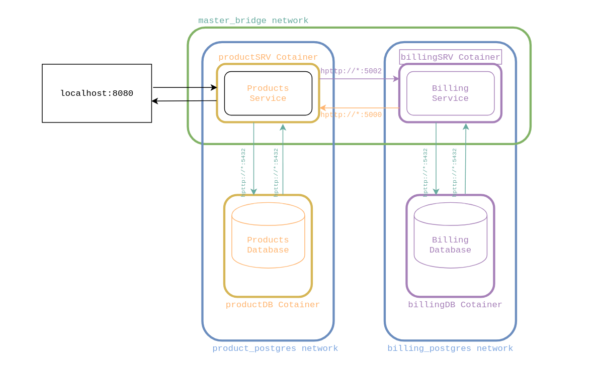

# services
## .Net Core Product and Billing service.

Live Demo at: http://146.148.102.96:80/api/products

## How to run?

```
$ docker-compose build
$ docker-compose up
```

```
add new produt(POST)  /api/products
body: add product model(below)
update produt(PUT)    /api/products
body: add product model(below)
get all products(GET) /api/products/{product_id}
get prodcut(GET)      /api/products/{product_id}
update stock(PUT)     /api/products/{product_id}/stock/{new_stock}
delete product(DELTE) /api/products/{product_id}
buy items(POST)       /api/products/buy
body: product_id array as string
get bill(GET)         /api/products/bill/{bill_id}
reset db(POST)        /api/products/reset
body: empty body
```

## Architecture
<p align="center">
  
</p>
***Live demo port is maped to 80  not 8080

#### Product Model
```C#
    Guid productId
    string productName
    uint productStock
    double productPrice
    string productDescription
    DateTime productRegisterDate
```

#### Add Product Model
```C#
    string productName
    uint productStock
    double productPrice
    string productDescription
```

#### Sale Model
```C#
        Guid billId
        Guid saleId
        Guid productRefId
        DateTime saleDate
        uint saleAmount
        double saleUnitPrice
        double saleTotalPrice
        uint stockLeft
```
